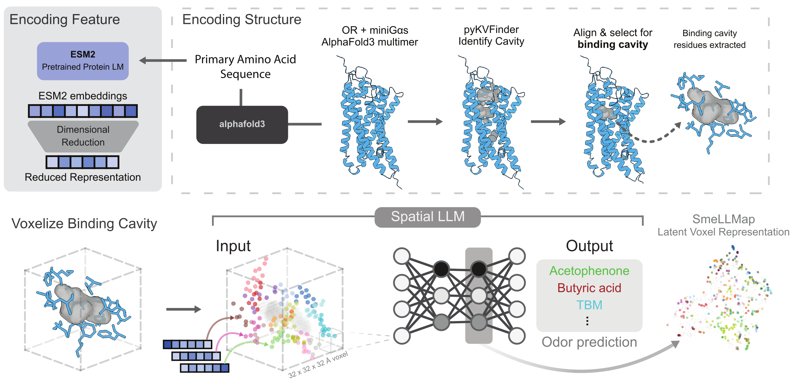

# OR_learning

> **Structure-guided olfactory receptor learning with ESM2, AlphaFold3, and spatial deep learning**

  

## Overview

`OR_learning` is the analysis workspace used to build a **structure-guided olfactory receptor learning pipeline**. It is **not a plug-and-play package**, but it is reasonably reproducible for readers who want to follow the procedure used in the study.

At a high level, the workflow is:

- generate **AlphaFold3** receptor structures
- align structures into a common frame
- identify and extract the **binding cavity**
- compute reduced **ESM2** residue features
- encode those features into a shared **3D voxel space**
- train CNN-based models for odor- and receptor-level prediction

In short, the repo supports a structural approach to mapping receptor sequence and cavity features onto odor response.

---

## High-level workflow and where to look

### 1) Generate AF3 structures
This step is upstream of most analyses in `OR_learning`.

- `../AF3_files/run_AF3_input.sh`
- `../alphafold3/run_alphafold.py`

These are used to prepare and run the AlphaFold3 jobs whose outputs are then analyzed here.

### 2) Align structures
Once AF3 models are available, the structures are aligned into a shared frame.

**Useful files:**
- `scripts/tmalign_pdb_dump_AF3.py`
- `notebooks/binding_cavity/bc_1_Structural_Sequence_Alignment.ipynb`

### 3) Identify and extract binding cavities
The next step is to detect cavities, compare them across receptors, and define a **canonical binding cavity**.

**Useful files:**
- `scripts/bc_cav_dump_AF3.py`
- `notebooks/binding_cavity/bc_0_binding_cavity.ipynb`
- `notebooks/binding_cavity/bc_AF3_CBC.ipynb`
- `notebooks/binding_cavity/bc_01_Canonical_binding_cavity.ipynb`

### 4) Compute ESM features
Sequence-based features are generated from OR amino acid sequences using ESM2 and then reduced for downstream use.

**Useful files:**
- `scripts/esm_embeddings.py`
- `notebooks/binding_cavity/esm_embeddings.ipynb`

### 5) Build spatial encodings
Cavity geometry and residue-level ESM features are combined into a shared voxel representation.

**Useful files:**
- `scripts/bc_Cbc_coords_AF3.py`
- `scripts/bc_Cbc_voxel_esm_dump.py`
- `notebooks/binding_cavity/bc_spatial_encoding_AF3.ipynb`
- `notebooks/binding_cavity/bc_spatial_feature_AF3.ipynb`

### 6) Train prediction models
The encoded cavity tensors are then used in CNN models for odor and related classification tasks.

**Useful files:**
- `scripts/cnn_spatialESM_Odorclassification_model_AF3.py`
- `scripts/cnn_spatialESM_Chemcalssification_model_AF3.py`
- `scripts/cnn_spatialESM_ORclassification_model_AF3.py`
- `scripts/cnn_spatialESM_binary_model_AF3.py`

### 7) Review figures and outputs
Final plots, summary analyses, and publication-oriented visualizations are saved in the notebooks and output folders.

**Useful files:**
- `notebooks/figures_code/Figures.ipynb`
- `output/spatialESM_OdorClass/`
- `output/Features/`
- `output/pub_Figures/`

---

## Repository navigation

| Path | What it contains |
|---|---|
| `notebooks/binding_cavity/` | Main step-by-step notebooks for the AF3 / cavity / spatial encoding workflow |
| `scripts/` | Scripted versions of preprocessing and training steps |
| `utils/` | Shared helper functions used throughout the notebooks and scripts |
| `files/` | Local inputs such as ESM embeddings, cavity coordinates, and response tables |
| `output/` | Model outputs, figures, and intermediate results |
| `img/` | Static images including the graphical abstract |

---

## Notes

- Many required inputs live in `files/` and are **not fully tracked in git**.
- Several scripts use local absolute paths such as `/mnt/data2/Justice/OR_learning/...`.
- Older exploratory material is kept in `notebooks/old/` and `scripts/old/`.

If you want the quickest orientation, start with:

1. `notebooks/binding_cavity/bc_01_Canonical_binding_cavity.ipynb`
2. `notebooks/binding_cavity/bc_spatial_encoding_AF3.ipynb`
3. `scripts/cnn_spatialESM_Odorclassification_model_AF3.py`

That order gives the clearest chronological view of how the pipeline is built.
